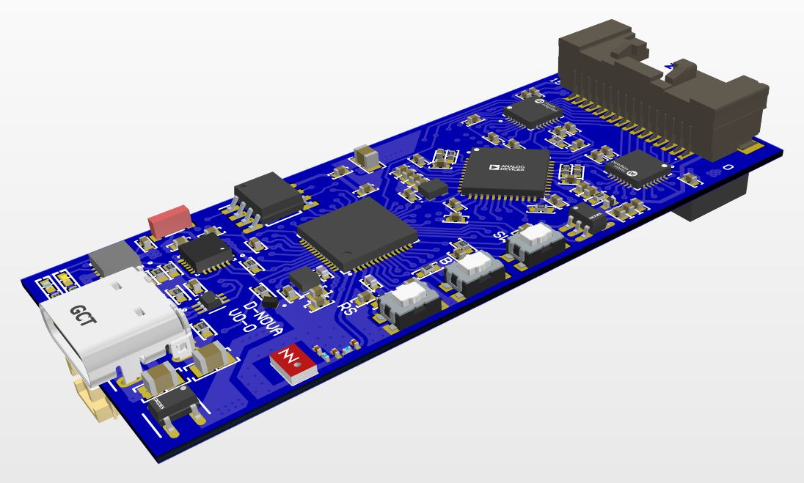

## Project Description

DecisioNova is a multi-purpose wearable development board for use with EIT-based robotic skins. The board is designed to be smaller than available EIT electronics and operate as a stand-alone wearable device. In robotics applications, DecisioNova can act as a measurement node placed near the robotic skin patch and stream measurements to the robot controller. In prosthetic devices, DecisioNova can be incorporated into prosthesis to enable both tactile sensing and feedback.




## PlatformIO Quick Start

1. Install PlatformIO and open the repository as project.
2. To select the example you want to compile, change the value of 'default_envs' in 'platformio.ini'. You can uncomment the desired example in 'platformio' section.
3. Compile and upload the example to the board.

## License 

Shield: [![CC BY-NC-SA 4.0][cc-by-nc-sa-shield]][cc-by-nc-sa]

This work is licensed under a
[Creative Commons Attribution-NonCommercial-ShareAlike 4.0 International License][cc-by-nc-sa].

[![CC BY-NC-SA 4.0][cc-by-nc-sa-image]][cc-by-nc-sa]

[cc-by-nc-sa]: http://creativecommons.org/licenses/by-nc-sa/4.0/
[cc-by-nc-sa-image]: https://licensebuttons.net/l/by-nc-sa/4.0/88x31.png
[cc-by-nc-sa-shield]: https://img.shields.io/badge/License-CC%20BY--NC--SA%204.0-lightgrey.svg

## Cite our work

`DecisioNova` is accepted in IEEE Humanoids Conference 2024, and will be online soon.

If you find this work useful, please cite the paper below!

(to be updated)

```bibtex
@inproceedings{Arezoomand2024,
   author = {Arezoomand, Arman and Baltzer, Heather and Azhari, Fae},
   booktitle = {2024 IEEE-RAS 23rd International Conference on Humanoid Robots (Humanoids)},
   title = {DecisioNova: An Open-source Miniaturized Development Board for EIT-based Robotic Skins},
   year = {2024},
}
```